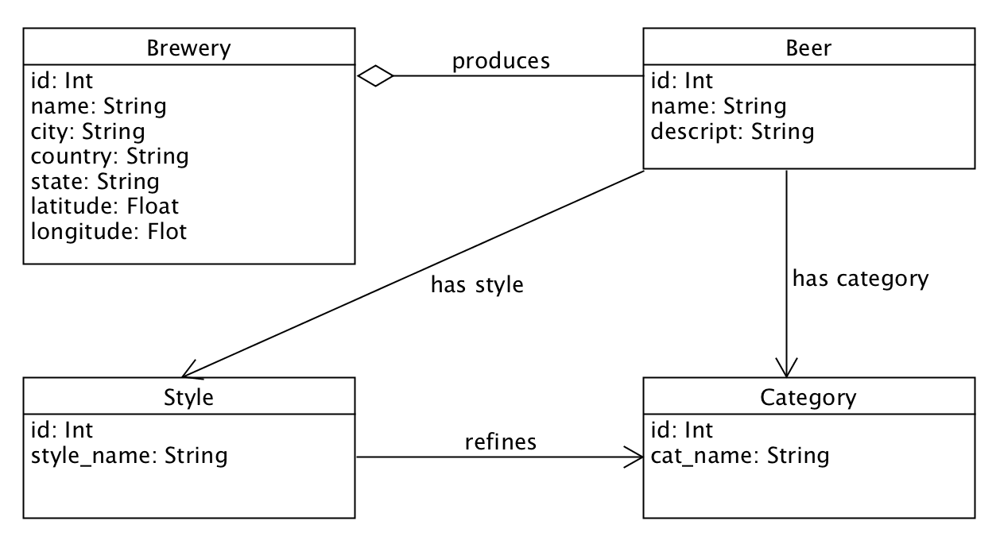
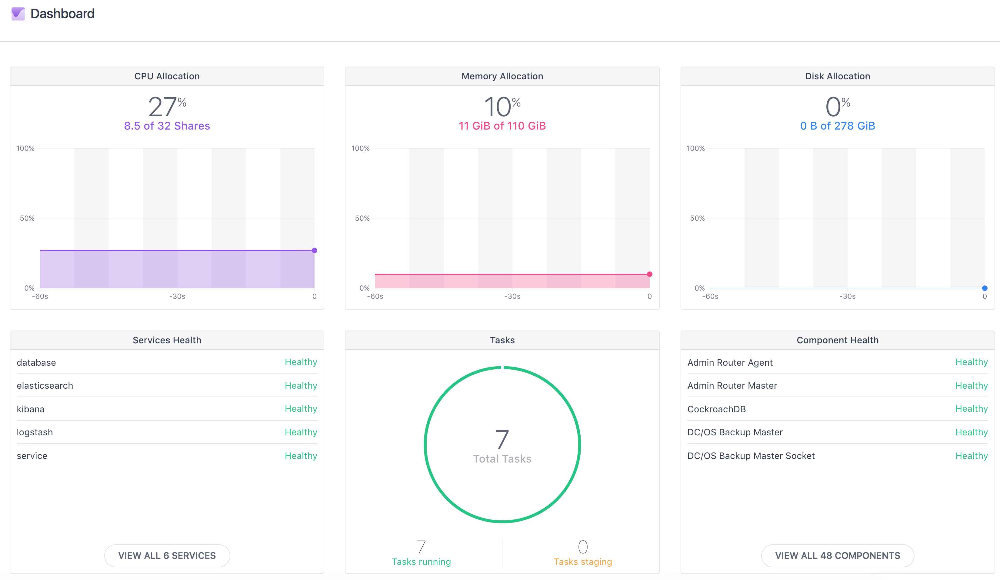
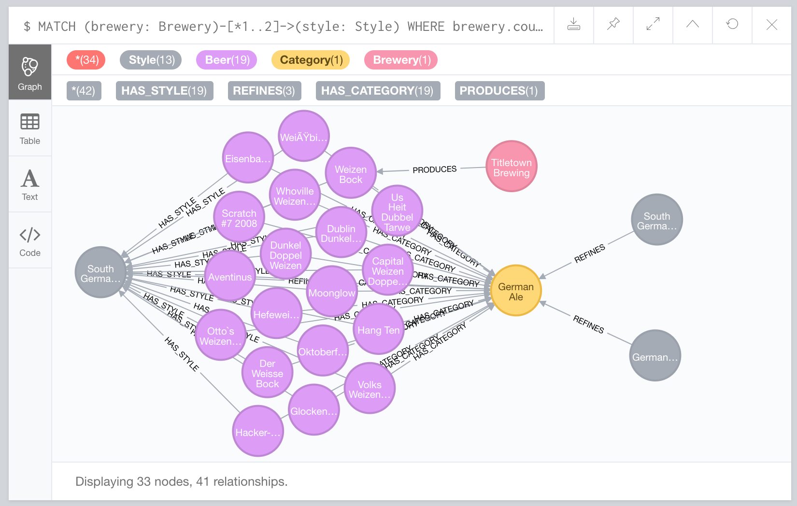

# The DC/OS beer demo

You wonder how [Java](http://www.oracle.com/technetwork/java/index.html), [Spring Boot](https://projects.spring.io/spring-boot/), [MySQL](https://www.mysql.com), [Neo4j](https://neo4j.com), [Zeppelin](), [Apache Spark](https://spark.apache.org/), [Elasticsearch](https://www.elastic.co), [Docker](https://www.docker.com) and [DC/OS](https://dcos.io) fits in one demo? Well, we'll show you! This is a rather complex demo, so grab your favorit beer and enjoy 🍺

## General problems of current data center layouts
Current data center architectures are mostly static partitioned. Meaning, that you have different sub clusters for each part of your system. Let's say you have 30 nodes to host your system, then you would typically slice this 30 nodes into smaller parts and assign dedicated applications to dedicated nodes. This has a couple of disadvantages. You need to optimize each sub part of your cluster against load peaks and if nodes are crashing during those peaks, you are not able to shift dynamically applications to other nodes. On the other hand you are wasting a lot of resources.

If we look at resource utilization in typical industry clusters, we see an average CPU utilization around 15% with this classic approach. But would'nt it be cool to be able to shift applications dynamically between nodes, be more flexible against failure and load peaks and increase the utilization to save money?


In this demo we will see an increasing cluster utilization by operating the Java service architecture together with all data applications on the same DC/OS cluster.

## The domain
In this demo we are talking all about beer. There is this old website [openbeerdb.com](https://openbeerdb.com) and they offer a quite old list of beer, breweries, beer categories and beer styles as downloadable sql files. But age doesn't matter for this demo, as long as you are old enough to drink.
You can find this sql files and the related readme in the `database/sql` folder. This database contains a list of around 1500 breweries and 6000 different beers with their relation to category and style. You can see the model and important properties in the diagram below:



## Overview
Ok, now you know the domain: Let's talk about our story! 

1. In this demo we want to build a simple Spring Boot service first which offers us a random beer of the day via HTTP API. To service this purpose, you can find a spring  boot web application in the `service` folder. We see all the application lifecycle steps here from deploy over scale to break, update and recover.
2. After we successfully implemented our service using the openbeerdb data, we want to do more analysis. For this reason we are using the Neo4j graph database. You can find the data migration implementation in the `neo4j-migration` folder. 
3. Using the power of a graph database, we can do fancy queries like `List all styles of beers produced in a certain and show many breweries produce it there` without the hassle of complicated joins.
4. After we did complex analysis in a graph database, we want to do mass analysis using a Map/Reduce job in Spark. Therefore you can find a Zeppelin notepad in the file `zeppelin-analysis.json` containing a Map/Reduce job to count all the words in beer descriptions to give an overview of what words are used in a beer description.
5. Last but not least we will see how use Elasticsearch to back our service architecture with a centralized logging system.

## 0. Docker
We are using Docker in this demo to package most parts of our system. This is important because we want to run exactly the same code in development, stage and production. We just want to change the environment specific configuration for each of those stages. 
You can find the Docker files in the `database` and `service` folders. Both images are rather simple and starting with a official base image of `mysql` or `java` and just adding the initial sql files or the application jar file.

Our docker compose configuration looks like this:

```
version: '2'
services:

  database:
    image: unterstein/dcos-beer-database:latest

  service:
    image: unterstein/dcos-beer-service:latest
    ports:
      - "8080:8080"
    depends_on:
      - database
    environment:
      - SERVICE_VERSION=2
      - SPRING_DATASOURCE_URL=jdbc:mysql://database:3306/beer?user=good&password=beer
```

You can see a database without configuration in the first section. In the second section you can see the configured java service. The service depends on the database and has environment specific configuration for it's version and the database connectivity.

## 1. The Spring Boot service
This service basically has three endpoints.

1. `GET /` delivers the beer of the day
2. `GET /application/health` will respond with a `HTTP 200` as long as the internal state indicates a healthy system. This endpoint will return a `HTTP 500` otherwise. The service is healthy by default.
3. `DELETE /health` You can switch the internal state of the service to unhealthy when calling this endpoint.

If you point your browser to `$dockerIp:8080`, you will get the following answer:

```
{
    "hostAddress": "172.23.0.3",
    "version": "2",
    "beerName": "Wicked Ale",
    "beerStyle": "American-Style Brown Ale",
    "beerDescription": "Pete's Wicked Ale is an experience out of the ordinary. Our tantalizing ruby-brown ale with distinctive malts and aromatic Brewers Gold hops is sure to stir up an urge to get loose."
}
```

You find the properties `hostAddress` and `version` which are for demoing purpose and we will se them later when using DC/OS to scale and update our application. When we scale out our service, we will see load-balanced responses and when we update our application, we will see rolling upgrades.

You also find the name of our beer of the day, the style of the beer and a description. This beer description sounds really tasty!

### 1.1 DC/OS application definition
Similar to a docker compose file, you can find a marathon group definition in the `marathon-configuration.json` file.

```
{
   "id":"/beer",
   "apps":[
      {
         "id":"/beer/database",
         "cpus":1,
         "mem":1024,
         "instances":1,
         "container":{
            "type":"DOCKER",
            "docker":{
               "image":"unterstein/dcos-beer-database",
               "network":"BRIDGE",
               "portMappings":[
                  {
                     "hostPort":0,
                     "containerPort":3306,
                     "protocol":"tcp",
                     "labels":{
                        "VIP_0":"database:3306",
                        "VIP_1":"3.3.0.6:3306"
                     }
                  }
               ]
            }
         },
         "healthChecks":[
            {
               "protocol":"TCP",
               "portIndex":0,
               "gracePeriodSeconds":300,
               "intervalSeconds":60,
               "timeoutSeconds":20,
               "maxConsecutiveFailures":3,
               "ignoreHttp1xx":false
            }
         ]
      },
      {
         "id":"/beer/service",
         "dependencies":[
            "/beer/database"
         ],
         "cpus":1,
         "mem":1024,
         "instances":2,
         "healthChecks":[
            {
               "protocol":"HTTP",
               "path":"/application/health",
               "portIndex":0,
               "timeoutSeconds":10,
               "gracePeriodSeconds":10,
               "intervalSeconds":2,
               "maxConsecutiveFailures":10
            }
         ],
         "container":{
            "type":"DOCKER",
            "docker":{
               "image":"unterstein/dcos-beer-service",
               "network":"BRIDGE",
               "portMappings":[
                  {
                     "hostPort":0,
                     "containerPort":8080,
                     "protocol":"tcp"
                  }
               ]
            }
         },
         "env":{
            "VERSION": "3",
            "SPRING_DATASOURCE_URL":"jdbc:mysql://database.marathon.l4lb.thisdcos.directory:3306/beer?user=good&password=beer"
         },
         "upgradeStrategy":{
            "minimumHealthCapacity":0.85,
            "maximumOverCapacity":0.15
         },
         "labels":{
            "HAPROXY_0_VHOST":"your.public.elb.amazonaws.com",
            "HAPROXY_GROUP":"external"
         }
      }
   ]
}
```

When we follow the application definition, we see that this is familiar to us, but we can just configure more things here. 

Each application has an identifier followed by resource limitations. Our database application is allowed to consume 1 CPU and 1GB of memory.
We want to start one database instance and we want to use the same docker images again as we used for docker compose. But now we need to configure a network option, because we are dealing with a real distributed system and not a local sandbox. In this example you see two [virtual IP](TODO) configurations. One with a name based pattern and one with an IP based pattern. With this configuration, each traffic on this name-port combination is routed to our database application.

Our java application has a dependency to the database, so it is deployed after the database is marked as healthy. This service also has resource limitations, but we want to start two instances of this service. We also have a health check configured for the java service.
The health check describes that the `/application/health` endpoint will be checked every 2 seconds after an initial grace period of 10 seconds if it returns a `HTTP 2xx`. If this check will fail 10 times in a row, this service will be replaced with another one.
To expose our application to the outside, we need to add a network configuration. Because we added a `labels` section for our HAproxy later in the configuration, we can use a random host port in this section.
To connect this java service to the database, we need to adjust the environment variables. In this example we are using the named based VIP pattern, so we need to use this discovery name `database.marathon.l4lb.thisdcos.directory`, see [docs](https://docs.mesosphere.com/1.10/usage/service-discovery/dns-overview/) for more information.
Last but not least we added configuration for rolling upgrades. During an upgrade, we want a maximum overcapacity of 15% and a minimum health capacity of 85%. Image you have running 20 services, a rolling upgrade would be like `start 3 new ones, wait to become healthy and then stop old ones`. If you don't like rolling upgrades, you can use blue/green or canary upgrades as well, see [docs](https://docs.mesosphere.com/1.8/usage/service-discovery/load-balancing-vips/) for more information.

### 1.1 Deploy our system to DC/OS
If you have the CLI installed, you can simply run `dcos marathon group add marathon-configuration.json` to install our group of applications. You can do this via the UI as well.

In order to expose this application to the outside, you will need to install marathon-lb. Marathon-lb is a dynamic HAproxy which will automatically configure by the running applications in marathon. If you have an application with this HAPROXY-labels, marathon-lb will route traffic from the outside load balanced to the healthy running instances. You can install marathon-lb via the UI or via the CLI, simply run `dcos package install marathon-lb`. 

### Check utilization
After this installation is finished, we should see a cluster utilization as shown below:



### 1.2 See it working
If you point your browser to your public ip, you will get an answer like this:

```
{
    "hostAddress": "172.17.0.2",
    "version": "3",
    "beerName": "Millennium Lager",
    "beerStyle": "German-Style Pilsener",
    "beerDescription": "A tasy classic pilsner."
}
```

Well, sounds like a decend lager! You can't argue that the germans are verbose ;-).

### 1.3 Scale it
Now we installed the application, we want to scale it. Simply run `dcos marathon update /beer/service instances=20`. This will change the property `instances` to 20 and start a deployment to reach this target instance count. If your cluster does not carry enough resources, a scale to 5 is also fine.

### 1.4 Break it
Ok, let's break it! Remember that we talked about health checks and that you can toggle them in our service? Running `curl -XDELETE https://your.public.elb.amazonaws.com/health` will change the health check of one running instance. If you navigate to the DC/OS UI, you will see one unhealthy instance. After around 20 seconds this unhealthy application will be replaced with a new one. This is why a health check is performed every 2 seconds and we configured 10 maximum consecutive failures.

### 1.5 Update it
Mostly every configuration change will trigger a deployment. Usually you would use a new docker version or change endpoints or something similar. In this example we will update our environment variable `VERSION`. Simply go to the UI and navigate to the java service and the environment section. You can change the configuration from 3 to 4 here. When you hit the save button, you will trigger a rolling deployment. When you now constantly refresh your browser tab with the beer of the day responses, you will see that sometimes you will get a `"version": "3"` and sometimes a `"version": "4"`.

## 2. Extract rich data to Neo4j
### 2.1 Install Neo4j
To install a proper Neo4j [causal cluster](http://neo4j.com/docs/operations-manual/current/clustering/causal-clustering/), simply run `dcos package install neo4j`. This will install a Neo4j cluster of 3 Neo4j core nodes. If you want to access your Neo4j cluster from the outside of your DC/OS cluster, you will need to install the `neo4j-proxy` package additionally. DC/OS is designed to run applications internally on private nodes by default.

### 2.2 The migration job
In order to migrate the database from Mysql to Neo4j, we need to run a migration. In DC/OS we have the possibility to run one time or scheduled jobs in the jobs section. Simply run `dcos job add migration-configuration.json` (TODO ADD) to add the job and `dcos job run migration` to execute it once.


## 3. Query connected data
After the job finished execution, we can see the result of our enriched and connected data. If you point your browser to https://publicIp:7474, you login to Neo4j with the default credentials `neo4j:dcos`. The graph model looks like this:


The special thing about graphs are, that hops between nodes are native database concepts and way cheaper than joins in relation databases. In Neo4j you can query patterns of node-relation combination. For example a query like this `MATCH (brewery: Brewery)-[*1..2]->(style: Style) WHERE brewery.country = "Germany" WITH style, count(*) as c RETURN style, c;` would return all breweries from germany which has a relation over maximum 2 hops to a style of beer. If you pick one of the resulting nodes and double click to expand relations, you might be lucky and get a result like this:



If you go for a more text based result, you could run `MATCH (brewery: Brewery)-[:PRODUCES]->(beer: Beer)-[:HAS_STYLE]->(style: Style) WHERE brewery.country = "Germany" WITH style, count(beer) as c ORDER BY c DESC RETURN style.name, c;` and get the following result:


So, we see the germany like to produce and probably to drink `South German-Style Hefeweizen`. We could re-run this query with `WHERE brewery.country = "United States"`, but well...there is no good american beer anyways ;-).

### Check utilization
After installing Neo4j and running the migration, we should see a cluster utilization as shown below:


You see, we increased the CPU utilization from 13% to 38% by running our data services together with our Java services.

## 4. Map/Reduce
Imagine we would have a huge data set which fits not in memory, but we want to do analysis on this data. Let's use Map/Reduce to solve this issue.

### 4.1 Install Zeppelin
First we need to install zeppelin, simply run `dcos package install zeppelin`. Zeppelin is a web notepage, where you can post scala code to a big text input field. When you hit the compile button, this scala code will be compiled and executed a proper Spark cluster.

### 4.2 Do the analytics
If you go the the DC/OS UI in the service section and hover the zeppelin application, you will see a link to an external application. Follow this link to Zeppelin UI. On the left handside you will see an option to upload a notebook, please upload the `zeppelin-analysis.json` file. When you now open the notebook, you will see a pre-defined Spark job. 


In the first section, you can see our declared dependencies. We want to import SQL data, therefore we import our MySQL connector.

In the second section, you see the actual job. First we create a connection, this time we are using IP based VIP discovery.
Then we are concurrenty querying for overall 5.000 beers, then filtering noise and splitting it to a single sequence of words. Then we are doing basic word count algorithm.

In the map phase we are transforming each single word to a tuple of (word, 1). For example the word `beer` would be transformed to `(beer, 1)`. This can be done highly in parallel.

In the reduce phase we are transforming each tuple with the same key to a new tuple, but the sum of the values. For example `(beer, 1)` and `(beer, 1)` would be transformed to `(beer, 2)`. This can also be done highly in parallel.

In the third and last section, you can query the result of the reduce phase with a SQL-like language. In this example we are selecting the word ordered by the occurence descending:


You can see the occurences of `573 on hops`, `488 on malt`, `428 flavor`. Yummy, this are good words to describe beer! So if I would be a data analyst, I would try to find relations between those frequent words to optimize my own beer description.

### Check utilization
After installing Zeppelin and running our Map/Reduce job, we should see a cluster utilization as shown below:


WOW! We increased the CPU utilization nearly to maximum to run our Spark job and went from initially 4 running tasks to 19. This is great 🎉

If we want to continue in this demo and install Elasticsearch, we need to give resources back to the cluster and de-install Zeppelin. But this is no problem, because Mesos is all about using only currently needed resources and give it back afterwards.

## 5. Elasticsearch
Ok, still not enough data applications installed? Good! I have one more thing for you! Let's go back to the `Catalog` in the DC/OS UI or use the CLI to install the Elasticsearch package.

